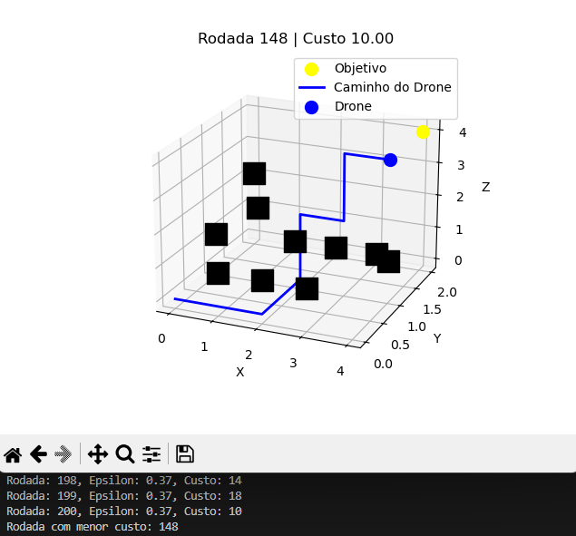

# Modelagem e Controle nãolinear do Quadrirrotor em Matlab-Simulink
MATLAB Version: 9.14.0.2206163 (R2023a)


O modelo Simulink `UAV_naolinear.slx` e o arquivo `modelo_naolinear_params.m` representam a modelagem de um veículo aéreo não tripulado tipo VANT quadrirrotor.

O modelo implementado é o seguinte:
```math
\begin{align}
    \begin{split}
		\dot{{\xi}}&=v\\
		\dot{v}&= -[0~0~{g}]^T+(1/m){{R}}_B^I[0~0~{T}_b]^T\\
		\dot{\omega}&=I^{-1}\left({M}-{\omega}\times{{I}}{\omega}\right)\\
		\dot{{\eta}}&={\mathcal{W}}{{\omega}}
    \end{split}    
\end{align}   
```
onde ${\xi}=(x,y,z)$ representa a posição do veículo no referencial inercial e ${v}=(v_x,v_y,v_z)$ representa a velocidade translacional. O vetor ${\omega}=(p,q,r)$ é a velocidade angular e ${\eta}=(\phi, \theta, \psi)$ são os ângulos de Euler.


## Aprendizado por Reforço para encontrar melhor trajetória do drone até um objetivo (python)

No contexto de aprendizado por reforço (Reinforcement Learning), as variáveis `gamma`, `alpha` e `epsilon` desempenham papéis importantes para o controle do aprendizado do agente. Vamos detalhar cada uma delas:

### 1. `gamma` (Fator de Desconto)
- **Objetivo**: Controlar a importância das recompensas futuras.
- **Descrição**: O fator de desconto, `gamma` (com valores entre 0 e 1), define o quanto o agente valoriza recompensas que estão no futuro em relação às recompensas imediatas. Quando `gamma` é próximo de 1, o agente considera as recompensas futuras como quase tão importantes quanto as recompensas imediatas. Já um valor de `gamma` mais próximo de 0 faz com que o agente se concentre apenas em recompensas imediatas, ignorando o longo prazo.
- **Exemplo de Uso**: Em cenários onde o objetivo é alcançar uma recompensa significativa no futuro (por exemplo, atravessar um labirinto para chegar ao objetivo final), valores mais altos de `gamma` são úteis. Valores baixos podem ser mais adequados para situações onde as recompensas devem ser obtidas rapidamente.

### 2. `alpha` (Taxa de Aprendizado)
- **Objetivo**: Controlar a velocidade de atualização dos valores de recompensa estimados.
- **Descrição**: A taxa de aprendizado, `alpha` (também entre 0 e 1), controla o peso das novas informações em relação ao conhecimento já adquirido pelo agente. Um `alpha` próximo de 1 significa que o agente atualiza agressivamente seus conhecimentos com base nas recompensas recentes, enquanto um `alpha` mais próximo de 0 significa que o agente faz atualizações mais lentas, dando mais peso ao que já aprendeu.
- **Exemplo de Uso**: Em ambientes com variações frequentes, um `alpha` alto permite que o agente aprenda rapidamente com novas experiências. Em ambientes mais estáveis, um `alpha` menor evita que o agente reaja de maneira exagerada a novas informações, consolidando melhor o aprendizado.

### 3. `epsilon` (Taxa de Exploração)
- **Objetivo**: Controlar o equilíbrio entre exploração e exploração do conhecimento atual.
- **Descrição**: A taxa de exploração, `epsilon`, determina a probabilidade de o agente escolher uma ação aleatória em vez de seguir a política aprendida (aquela que maximiza as recompensas com base na tabela Q). Valores mais altos de `epsilon` incentivam a exploração de novas ações, enquanto valores mais baixos fazem o agente se concentrar em ações já conhecidas como eficazes. Em muitos algoritmos, `epsilon` começa alto e vai diminuindo conforme o agente aprende, uma técnica chamada `epsilon-greedy`.
- **Exemplo de Uso**: A exploração é crucial no início do treinamento, quando o agente ainda está aprendendo sobre o ambiente. Conforme o aprendizado avança e o agente já conhece as melhores ações, `epsilon` deve ser reduzido para permitir que o agente explore menos e explote mais suas experiências.

### Resumo
- `gamma`: Define o horizonte do agente, ou seja, quanto o agente valoriza recompensas futuras.
- `alpha`: Controla a rapidez com que o agente aprende e atualiza suas estimativas de valor.
- `epsilon`: Balanceia entre explorar ações desconhecidas e explorar o conhecimento atual.

Esses três parâmetros são fundamentais para ajustar o comportamento do agente e garantir que ele consiga aprender de forma eficiente no ambiente em que está inserido.

